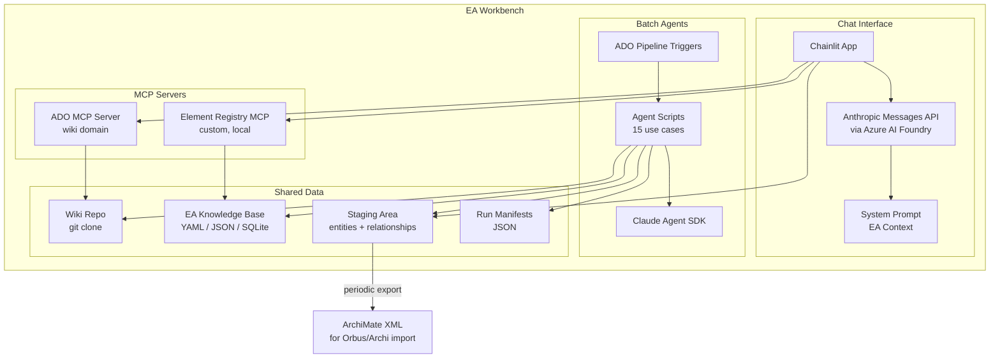

# Stanmore PFC — Requirements Specification

**Stanmore Resources** | Technology — Enterprise Systems
**Product Owner**: Justin — Enterprise Architect, AI & Advanced Analytics
**Status**: DRAFT | February 2026

---

## 1. Product Vision

The EA Workbench — operationally named **Stanmore PFC** (Pre-Frontal Cortex) — is the Enterprise Architect's operational layer for the Stanmore Intelligence System (SIS Brain). It provides:

1. **A chat interface** for interactive architectural research, design exploration, wiki-based knowledge work, and structured capture of needs, decisions, and practice artefacts
2. **A batch agent runner** for automated governance, classification, and document generation tasks
3. **An observability layer** showing agent run history, extraction results, and wiki health
4. **A motivation layer** for capturing stakeholder needs, architectural requirements, and the traceability chain between them

The PFC is NOT a business-user-facing product. It is the architect's daily working environment — the operational layer that builds and governs the SIS Brain.

### 1.0.1 Source of Truth and System of Record

The PFC git repository is the **source of truth** — where EA knowledge is authored, maintained, and governed. All architectural content (elements, relationships, practice artefacts, needs, requirements, specs, capability models) lives here in agent-readable, version-controlled formats.

Orbus iServer is the **system of record** — the formal enterprise architecture repository that receives syndicated content for enterprise-wide consumption, stakeholder views, and formal EA reporting.

The data flow is always **PFC → Orbus**, never the reverse. The PFC produces ArchiMate Open Exchange XML and curated views; Orbus consumes them. This separation means:

- The architect works in the PFC (fast, git-native, agent-augmented)
- Orbus receives a governed, reviewed subset (formal, publishable, enterprise-accessible)
- If Orbus is unavailable or deprioritised, no EA work stops — the PFC is self-sufficient
- The ArchiMate export pipeline (Section 7.5) is the syndication mechanism

### 1.1 Success Criteria

- The architect can query the ADO wiki conversationally and get grounded answers with page references
- The architect can trigger batch agents from the chat interface and see results
- Every agent run that touches architectural content automatically extracts structured entities and relationships to a staging area
- Stakeholder needs, requirements, decisions, risks, and other practice artefacts are captured with provenance tracing back to the conversation that produced them
- A periodic export from staging produces ArchiMate Open Exchange XML importable to Orbus
- The PFC repo is the canonical source of truth for all EA knowledge; Orbus is a downstream system of record
- Practice artefacts (principles, standards, decisions, NFRs, ideas, strategies) are first-class objects in the EA repo with full lifecycle management

### 1.2 What This Is Not

- Not a visual architecture editor (that's Helix Phase 2)
- Not a business-user chatbot (that's the SIS Brain runtime agents via Foundry Agent Service + Copilot Studio)
- Not an Orbus replacement — Orbus remains the system of record for enterprise-wide EA publishing
- Not a project management tool — DevOps is the work management layer; PFC stages work items for DevOps consumption

---

## 2. Architecture Overview

### 2.1 Two Execution Modes

The Workbench has two fundamentally different execution paths. They share the same knowledge base, entity extraction protocol, and staging area, but use different runtime patterns:

| Concern | Chat Mode | Batch Mode |
|---|---|---|
| **Runtime** | Anthropic Messages API with tool calling | Claude Agent SDK with filesystem tools |
| **Interface** | Chainlit web UI | CLI invocation or ADO Pipeline trigger |
| **Tools** | MCP servers (ADO wiki, element registry) | Read, Write, Bash on local filesystem |
| **Interaction** | Multi-turn conversation | Single prompt → structured output |
| **Governance** | Track 2 (informal, exploratory) | Track 1-adjacent (auditable, repeatable) |
| **Model** | Claude via Azure AI Foundry | Claude/Gemini via Azure AI Foundry (model routing per agent) |

### 2.2 Shared Infrastructure

Both modes operate on and write to:

- **PFC repo** (git clone of ADO wiki — the canonical EA knowledge base and source of truth)
- **EA knowledge base** (structured YAML/JSON/SQLite files in git — capabilities, elements, vocabulary, practice artefacts, motivation layer)
- **Staging area** (`.staging/entities/`, `.staging/relationships/`, `.staging/work/` — structured extractions from every agent run or chat session)
- **Session records** (`.staging/sessions/` — conversation summaries with provenance linking staged artefacts to their originating discussions)
- **Run manifests** (`.agents/runs/` — JSON records of every batch agent execution)

### 2.3 Model Routing

All LLM calls route through Azure AI Foundry (`CLAUDE_CODE_USE_FOUNDRY=1` for Agent SDK; Azure OpenAI endpoint for Messages API). No data leaves Stanmore's Azure tenant.

Model selection per task type:

| Task Type | Model | Rationale |
|---|---|---|
| Architectural judgment, assessment, design | Claude Sonnet 4.5 | Nuance, reasoning quality |
| Extraction, classification, structural validation | Gemini 2.5 Flash (or equivalent) | Speed, cost, sufficient for pattern matching |
| Spec authoring, communication generation | Claude Sonnet 4.5 | Writing quality |
| Simple structural checks (link validation, schema conformance) | Lightest available | Cost efficiency |

Model routing is configured per agent in `.agents/config.yaml`, not hardcoded.

### 2.4 Component Diagram (Mermaid)



---

## 3. EA Knowledge Base Structure

The PFC repo (git clone of ADO wiki or companion git repo) holds all EA knowledge in agent-readable, version-controlled formats. This is the canonical source of truth. Orbus iServer receives syndicated ArchiMate exports as the system of record.

### 3.1 Directory Structure

```
stanmore-pfc/
├── capabilities/
│   ├── capability-model.yaml          # hierarchical capability tree
│   └── capability-metadata.yaml       # ownership, maturity, status per capability
├── elements/
│   ├── registry.db                    # SQLite — architectural element registry
│   └── by-domain/                     # YAML files per domain for human readability
│       ├── safety.yaml
│       ├── geology.yaml
│       ├── maintenance.yaml
│       └── knowledge-infrastructure.yaml
├── vocabulary/
│   ├── enterprise-glossary.yaml       # canonical terms with definitions
│   └── domain/
│       ├── safety-vocabulary.yaml
│       ├── geology-vocabulary.yaml
│       └── mining-ops-vocabulary.yaml
├── architecture/
│   ├── principles/                    # Architectural principles register
│   │   ├── _index.yaml                # id, name, status, rationale summary
│   │   └── PRI-001-spec-imperative.md
│   ├── standards/                     # Standards & policies register
│   │   ├── _index.yaml
│   │   └── STD-001-dual-track.md
│   ├── decisions/                     # Architecture Decision Records
│   │   ├── _index.yaml
│   │   └── ADR-001-chainlit.md
│   ├── nfrs/                          # Non-functional requirements register
│   │   ├── _index.yaml                # id, category, threshold, target, measured_by
│   │   └── NFR-001-rag-retrieval-accuracy.md
│   ├── ideas/                         # Ideas register (parked for evaluation)
│   │   ├── _index.yaml                # id, name, status (parked/evaluating/adopted/rejected)
│   │   └── IDEA-001-meta-agent-spawning.md
│   ├── strategies/                    # Strategic positions and approaches
│   │   ├── _index.yaml                # id, name, affects_roadmap, rationale
│   │   └── STRAT-001-fabric-iq-phase2-gate.md
│   └── archimate/                     # ArchiMate Open Exchange XML fragments
├── needs/                             # Business needs (ArchiMate: Goal)
│   ├── _index.yaml                    # Register of all needs
│   ├── by-domain/
│   │   ├── safety.yaml
│   │   ├── knowledge-layer.yaml
│   │   └── maintenance.yaml
│   └── engagements/                   # Stakeholder engagement session records
│       ├── ENG-001-safety-managers-workshop.md
│       └── ENG-002-rob-knowledge-layer-review.md
├── requirements/                      # Solution requirements (ArchiMate: Requirement)
│   ├── _index.yaml                    # Register of all requirements
│   └── by-domain/
│       ├── safety.yaml
│       ├── knowledge-layer.yaml
│       └── maintenance.yaml
├── specs/
│   ├── tier1/                         # Top-level architecture overviews
│   ├── tier2/                         # Detailed component/domain specs
│   ├── tier3/                         # Implementation-level specs
│   └── templates/                     # Wiki page templates per tier
├── .staging/
│   ├── entities/                      # Agent-extracted entity records (YAML)
│   ├── relationships/                 # Agent-extracted relationship records (YAML)
│   ├── work/                          # Work artefact staging (tasks, risks → DevOps)
│   ├── sessions/                      # Conversation session summaries with provenance
│   ├── approved/                      # Architect-reviewed and approved extractions
│   └── exports/                       # Generated ArchiMate XML for Orbus import
├── .agents/
│   ├── runs/                          # Execution manifests (JSON per run)
│   ├── prompts/                       # System prompt files per agent
│   ├── config.yaml                    # Agent registry — models, tools, schedules
│   └── templates/                     # Output templates per agent
└── README.md
```

### 3.2 Element Registry (SQLite)

The element registry is a SQLite database providing relational queries over architectural elements. It is the structured shadow of what exists in the wiki specs.

**Schema:**

```sql
CREATE TABLE elements (
    id TEXT PRIMARY KEY,                    -- e.g., 'comp-doc-intel-pipeline'
    name TEXT NOT NULL,
    archimate_type TEXT NOT NULL,           -- ArchiMate element type
    domain TEXT NOT NULL,                   -- bounded context
    status TEXT DEFAULT 'proposed',         -- proposed/approved/deployed/deprecated
    description TEXT,
    source_spec TEXT,                       -- wiki page path where defined
    source_line INTEGER,
    created_at TEXT DEFAULT CURRENT_TIMESTAMP,
    updated_at TEXT DEFAULT CURRENT_TIMESTAMP,
    created_by TEXT,                        -- agent run ID or 'manual'
    confidence REAL DEFAULT 1.0            -- 1.0 for manual, <1.0 for agent-extracted
);

CREATE TABLE relationships (
    id TEXT PRIMARY KEY,
    source_element_id TEXT NOT NULL REFERENCES elements(id),
    target_element_id TEXT NOT NULL REFERENCES elements(id),
    archimate_type TEXT NOT NULL,           -- ArchiMate relationship type
    description TEXT,
    source_spec TEXT,
    evidence TEXT,                          -- quote or section reference
    confidence REAL DEFAULT 1.0,
    created_at TEXT DEFAULT CURRENT_TIMESTAMP,
    created_by TEXT,
    UNIQUE(source_element_id, target_element_id, archimate_type)
);

CREATE TABLE capabilities (
    id TEXT PRIMARY KEY,
    name TEXT NOT NULL,
    parent_id TEXT REFERENCES capabilities(id),
    level INTEGER NOT NULL,                -- depth in hierarchy
    domain TEXT,
    maturity TEXT,                          -- initial/defined/managed/optimised
    description TEXT
);

CREATE TABLE element_capabilities (
    element_id TEXT REFERENCES elements(id),
    capability_id TEXT REFERENCES capabilities(id),
    relationship_type TEXT DEFAULT 'realizes',
    PRIMARY KEY (element_id, capability_id)
);

-- Views for common queries
CREATE VIEW v_orphan_elements AS
SELECT e.* FROM elements e
LEFT JOIN element_capabilities ec ON e.id = ec.element_id
WHERE ec.capability_id IS NULL;

CREATE VIEW v_domain_summary AS
SELECT domain, archimate_type, status, COUNT(*) as count
FROM elements GROUP BY domain, archimate_type, status;
```

### 3.3 Capability Model (YAML)

```yaml
# capabilities/capability-model.yaml
version: "1.0"
last_updated: "2026-02-26"

capabilities:
  - id: "cap-ai-knowledge"
    name: "AI & Knowledge Management"
    level: 0
    children:
      - id: "cap-knowledge-layer"
        name: "Enterprise Knowledge Layer"
        level: 1
        domain: "knowledge-infrastructure"
        children:
          - id: "cap-doc-ingestion"
            name: "Document Ingestion & Processing"
            level: 2
            maturity: "initial"
          - id: "cap-vector-retrieval"
            name: "Vector Retrieval"
            level: 2
            maturity: "initial"
          - id: "cap-graph-reasoning"
            name: "Graph-Based Reasoning"
            level: 2
            maturity: "planned"
      - id: "cap-agent-runtime"
        name: "Agent Runtime & Orchestration"
        level: 1
        domain: "cognition"
        children:
          - id: "cap-domain-agents"
            name: "Domain-Specific Agents"
            level: 2
          - id: "cap-agent-governance"
            name: "Agent Governance & Guardrails"
            level: 2
```

### 3.4 Staging File Format

See Section 7 (Entity Extraction Protocol) for the full staging YAML schema.

### 3.5 Practice Artefact Registers

Each practice artefact type has an `_index.yaml` register file that provides a machine-readable catalogue. The register schema is consistent across types:

```yaml
# architecture/{type}/_index.yaml
version: "1.0"
last_updated: "2026-03-02"
items:
  - id: "PRI-001"
    title: "The Specification Imperative"
    status: "active"          # active | draft | deprecated | superseded
    created_at: "2026-02-20"
    updated_at: "2026-03-01"
    file: "PRI-001-spec-imperative.md"
    domain: "enterprise"      # enterprise | domain-specific
    summary: "As AI assumes implementation, precise articulation of intent becomes the irreplaceable human contribution"
```

Each practice artefact markdown file follows a consistent structure: title, status metadata block, statement/description, rationale, implications, and provenance (if captured from a conversation).

---

## 3A. Motivation Layer — Needs and Requirements

The PFC implements the ArchiMate Motivation layer to capture the chain from stakeholder concerns through to solution requirements. This is the bridge between "what the business needs" and "what the architecture delivers."

### 3A.1 ArchiMate Alignment

| PFC Concept | ArchiMate Element Type | Layer | Description |
|---|---|---|---|
| Stakeholder | `stakeholder` | Motivation | Person or group with interests in the architecture |
| Driver | `driver` | Motivation | Internal/external condition that motivates change (pains, pressures, opportunities) |
| Assessment | `assessment` | Motivation | Outcome of analysing a driver in context |
| Need | `goal` | Motivation | What the stakeholder wants to achieve — solution-independent |
| Outcome | `outcome` | Motivation | Desired end result of meeting a need |
| Requirement | `requirement` | Motivation | Solution attribute that satisfies a need — solution-specific |
| Constraint | `constraint` | Motivation | Restriction on how a requirement may be realised |
| Principle | `principle` | Motivation | Normative property that applies across the architecture |

The critical separation: a **need** (`goal`) is stakeholder-owned and solution-independent. "I need to find the current version of a safety procedure quickly" persists regardless of implementation. A **requirement** (`requirement`) is solution-specific: "The RAG pipeline shall return the authoritative document version with >85% precision@5." The need survives even if the solution changes entirely.

### 3A.2 Engagement Record Schema

Engagements are structured records of stakeholder interactions where needs are surfaced. They are the primary input mechanism for the motivation layer.

```yaml
# needs/engagements/ENG-001-safety-managers-workshop.yaml
id: "ENG-001"
title: "Safety Managers Knowledge Access Workshop"
date: "2026-03-15"
type: "workshop"              # workshop | interview | review | observation
participants:
  - role: "Safety Manager — North Goonyella"
  - role: "Enterprise Architect"
    name: "Justin Hume"
context: |
  Workshop to understand how safety managers currently find and use
  safety procedures, incident reports, and regulatory guidance.

needs_identified:
  - ref: "NEED-001"
  - ref: "NEED-002"

provenance:
  session_id: "chainlit-session-xyz"
  conversation_summary: |
    Workshop focused on procedure retrieval pain points.
    Safety managers spend 10-15 minutes per lookup, often uncertain
    whether the version found is current. Cross-referencing training
    requirements against equipment and site requires 3-4 documents.
```

### 3A.3 Need Schema

```yaml
# needs/by-domain/safety.yaml
needs:
  - id: "NEED-001"
    statement: "Find the current authoritative version of a safety procedure quickly"
    archimate_type: "goal"
    domain: "safety"
    stakeholders:
      - "Safety Manager"
      - "Site Supervisor"
    drivers:                           # ArchiMate: driver
      - "Multiple versions exist across SharePoint sites"
      - "No way to confirm which version is current without manual checking"
      - "Search returns old versions alongside current ones"
    outcomes:                          # ArchiMate: outcome
      - "Confidence that the procedure being followed is the approved version"
      - "Reduce lookup time from 15 minutes to under 1 minute"
    priority: "high"
    engagement_ref: "ENG-001"
    requirements_derived:
      - "REQ-001"
      - "REQ-002"
```

### 3A.4 Requirement Schema

```yaml
# requirements/by-domain/safety.yaml
requirements:
  - id: "REQ-001"
    traces_to_need: "NEED-001"
    statement: "The knowledge retrieval system shall return only the current authoritative version of a document by default"
    archimate_type: "requirement"
    type: "functional"
    domain: "safety"
    acceptance_criteria:
      - "Default query excludes documents with status=Superseded"
      - "Document authority scoring boosts Official (100) over Draft (50)"
      - "User can explicitly request historical versions via filter"
    realised_by:                       # ArchiMate: realization-relationship
      - element_id: "comp-doc-authority-scoring"
        element_name: "Document Authority Scoring Profile"
      - element_id: "tech-ai-search-index"
        element_name: "Azure AI Search Index"

  - id: "REQ-002"
    traces_to_need: "NEED-001"
    statement: "Procedure lookup latency shall not exceed 5 seconds end-to-end"
    archimate_type: "constraint"
    type: "non-functional"
    domain: "safety"
    nfr_ref: "NFR-003"               # links to NFR register in architecture/nfrs/
    category: "performance"
    threshold: "5000ms"
    target: "2000ms"
```

### 3A.5 Traceability Chain

The full chain is: **Stakeholder → Engagement → Need (Goal) → Requirement → Element/Capability**. This maps directly to ArchiMate relationships:

- Stakeholder `association` Driver
- Driver `association` Assessment
- Assessment `association` Goal (Need)
- Goal `realization` Requirement
- Requirement `realization` Element (application-component, technology-service, etc.)
- Element `realization` Capability

The entity extraction protocol (Section 7) can extract all of these as typed elements, and the ArchiMate export (Section 7.5) includes them in the Open Exchange XML for Orbus syndication.

---

## 3B. Practice Artefacts

Practice artefacts are first-class EA outputs that live permanently in the repo. They are distinct from staging items (which are transient extractions awaiting review). Practice artefacts are authored — they are the architect's own output.

### 3B.1 Type Taxonomy

| Type | ArchiMate Mapping | Location in Repo | Lifecycle |
|---|---|---|---|
| Principle | `principle` (Motivation) | `architecture/principles/` | active → deprecated |
| Standard/Policy | (no direct ArchiMate type) | `architecture/standards/` | draft → active → deprecated |
| Decision (ADR) | (no direct ArchiMate type) | `architecture/decisions/` | proposed → accepted → superseded |
| NFR | `constraint` (Motivation) | `architecture/nfrs/` | draft → active → measured |
| Idea | (no direct ArchiMate type) | `architecture/ideas/` | parked → evaluating → adopted/rejected |
| Strategy | `course-of-action` (Strategy) | `architecture/strategies/` | proposed → active → superseded |
| Need | `goal` (Motivation) | `needs/by-domain/` | identified → validated → addressed |
| Requirement | `requirement` (Motivation) | `requirements/by-domain/` | draft → approved → implemented → verified |
| Engagement | (no direct ArchiMate type) | `needs/engagements/` | immutable record |

Principles, strategies, needs, and requirements have ArchiMate element types and participate in the entity extraction → staging → Orbus export pipeline. Decisions, standards, ideas, and engagements are EA practice records that live in the repo but not in the ArchiMate model.

### 3B.2 Durable vs Transient Artefacts

When the chat agent or batch agent identifies something during a conversation, the routing depends on the artefact type:

**Durable items** — authored into the EA repo via wiki write protocol (Section 3E):

| Type | Created Via | Destination |
|---|---|---|
| Decision | Chat conversation or analysis | `architecture/decisions/ADR-NNN.md` |
| Principle | Chat conversation | `architecture/principles/PRI-NNN.md` |
| Standard | Chat conversation or review | `architecture/standards/STD-NNN.md` |
| NFR | Chat conversation or engagement | `architecture/nfrs/NFR-NNN.md` |
| Idea | Chat conversation | `architecture/ideas/IDEA-NNN.md` |
| Strategy | Chat conversation or analysis | `architecture/strategies/STRAT-NNN.md` |
| Need | Engagement or chat conversation | `needs/by-domain/{domain}.yaml` |
| Requirement | Derived from need | `requirements/by-domain/{domain}.yaml` |
| Engagement | Stakeholder session | `needs/engagements/ENG-NNN.md` |

**Transient items** — staged in `.staging/work/`, triaged to DevOps:

| Type | Created Via | Destination |
|---|---|---|
| Task | Chat conversation | DevOps work item (via ADO MCP) |
| Risk | Chat conversation or analysis | DevOps issue or risk register wiki page |

All items — durable and transient — carry provenance (Section 3D) linking them to the conversation that produced them.

---

## 3C. Work Artefact Staging

Work artefacts that are transient (tasks, risks destined for DevOps) stage in `.staging/work/` before triage. This uses the same review pattern as entity staging — agent proposes, architect confirms.

### 3C.1 Work Staging Schema

```yaml
# .staging/work/chat_{session_id}_{sequence}.yaml
metadata:
  extracted_by: "chat-agent"
  session_id: "chainlit-session-a1b2c3d4"
  timestamp: "2026-03-02T10:45:00Z"

items:
  - type: "task"
    title: "Investigate Purview label coverage on Safety SharePoint"
    description: |
      Assess current sensitivity label coverage on Safety & Procedures
      SharePoint site. Document coverage percentage and identify
      unlabelled content categories. Required before Phase 1 scope expansion.
    priority: "high"
    domain: "knowledge-infrastructure"
    blocks: "Phase 1 scope confirmation"
    suggested_devops_type: "Task"
    suggested_area_path: "Technology\\Enterprise Systems\\Knowledge Layer"
    provenance:
      session_id: "chainlit-session-a1b2c3d4"
      conversation_summary: |
        During analysis of Knowledge Layer ingestion spec, identified
        Purview label coverage gap on Safety SharePoint. Blocks Phase 1
        expansion because unlabelled docs could surface confidential
        content through RAG pipeline.
      trigger_message: "What happens if Purview labels aren't applied to half the safety docs?"

  - type: "risk"
    title: "Purview label coverage may be below 30% on Safety SharePoint"
    description: |
      If coverage very low, even Safety domain has governance gaps.
      Mitigation: fall back to ACL-only trimming (ADR-005).
    likelihood: "medium"
    impact: "high"
    mitigation: "ACL-only trimming via Entra as per ADR-005"
    suggested_devops_type: "Issue"
    provenance:
      session_id: "chainlit-session-a1b2c3d4"
      conversation_summary: "Identified during Purview coverage analysis..."
```

### 3C.2 Triage Workflow

1. Work artefacts staged locally in `.staging/work/`
2. Architect reviews via `/triage` command
3. Approved tasks pushed to DevOps with:
   - Work item description includes conversation summary from provenance
   - Link back to Chainlit session (durable while session persists)
   - Area path, work item type, priority from staging metadata
4. Rejected items deleted from staging
5. DevOps work item carries semantic traceability even if session link breaks

---

## 3D. Provenance Model

Every staged or authored artefact carries a provenance record linking it to the conversation that produced it. Structured outputs are lossy without provenance — a DevOps work item saying "Investigate Purview label coverage" is actionable, but the conversation where the coverage gap was discovered and implications discussed is the actual value.

### 3D.1 Provenance Schema

```yaml
provenance:
  session_id: "chainlit-session-a1b2c3d4"
  timestamp: "2026-03-02T10:45:00Z"
  conversation_summary: |
    Dense paragraph capturing reasoning, not just conclusion.
    During analysis of Knowledge Layer ingestion spec, identified
    Purview label coverage gap on Safety SharePoint. Blocks Phase 1
    expansion because unlabelled docs could surface confidential
    content through RAG pipeline.
  trigger_message: "What happens if Purview labels aren't applied to half the safety docs?"
  key_exchanges:
    - role: "user"
      summary: "Asked about Purview label gap risk"
    - role: "assistant"
      summary: "Identified unlabelled docs bypass sensitivity trimming"
    - role: "user"
      summary: "Confirmed blocks Phase 1 — needs investigation task"
  session_link: "http://localhost:8000/chat/a1b2c3d4"
  related_artefacts:
    - type: "entity"
      name: "Purview Label Scanner"
      staged_in: ".staging/entities/chat_a1b2c3d4_003.yaml"
    - type: "spec"
      path: "specs/tier2/knowledge-layer-ingestion.md"
      section: "§7 Risks and Mitigations"
```

### 3D.2 Why Semantic Summary, Not Just a Link

1. Chat sessions can be long (2-hour session → 15 staged items across 6 topics). Linking to "whole chat" isn't useful.
2. Chat persistence may be limited. The summary is durable even if raw chat is gone.
3. DevOps consumers need context without replaying entire transcripts.

---

## 3E. Wiki Write Protocol

When the chat agent creates or modifies EA repo files (wiki pages, practice artefacts, needs, requirements), it follows a human-in-the-loop protocol. The architect always sees the proposed change before it takes effect.

### 3E.1 Protocol Rules

1. **NEVER write directly without user confirmation.**
2. **For NEW pages**: Draft the full content, present it in a collapsible Chainlit step (rendered as markdown). Ask for review. Only write after explicit approval.
3. **For UPDATES**: Read the current page first, describe what is proposed and why, show the affected sections (before → after), ask for review.
4. **For PRACTICE ARTEFACTS** (principles, decisions, NFRs, needs, requirements): Use the template from the relevant `_index.yaml`. Walk the architect through each field conversationally rather than dumping a completed template.
5. **After writing**: Confirm the file path and offer to update the relevant `_index.yaml` register.

### 3E.2 Change Presentation

The agent presents changes as:
- Summary of what changed and why
- Specific sections modified (before/after in code fences)
- Confirmation prompt

Chainlit does not have a native diff renderer. The agent simulates this by showing the affected sections clearly marked.

---

## 3F. Session Summary Protocol

Every chat session produces a structured summary capturing what was discussed, what was staged, and what artefacts were produced. This enables weekly summary generation and provides the provenance backbone.

### 3F.1 Session Record Schema

```yaml
# .staging/sessions/{session_id}.yaml
session_id: "chainlit-session-a1b2c3d4"
started_at: "2026-03-02T09:30:00Z"
ended_at: "2026-03-02T11:15:00Z"
session_link: "http://localhost:8000/chat/a1b2c3d4"

intent: "Working on Knowledge Layer ingestion spec — reviewing risks and gaps"

summary: |
  Reviewed Knowledge Layer ingestion pipeline design focusing on
  governance gaps. Key outcomes: confirmed Safety-only scope for MVP
  (ADR-002 rationale strengthened), identified Purview label coverage
  as blocking investigation for Phase 1, surfaced risk around label
  coverage below useful thresholds.

artefacts_produced:
  entities_staged: 2
  relationships_staged: 1
  work_items_staged: 3
  practice_artefacts_authored: 1
  specs_modified: 0
  needs_captured: 0

staged_references:
  - ".staging/entities/chat_a1b2c3d4_001.yaml"
  - ".staging/work/chat_a1b2c3d4_001.yaml"

topics_discussed:
  - "Purview label coverage on Safety SharePoint"
  - "Ingestion pipeline governance for unlabelled content"
  - "Phase 1 scope dependency on label remediation"
```

### 3F.2 Weekly Summary Generation

Session records feed a weekly summary agent. It aggregates all session records for the week, groups by type, produces markdown following the established weekly planning template:

```
Week N Summary:
  Key Goals & Tasks: [aggregated from type=task items across sessions]
  General Tasks: [lower-priority tasks]
  Architecture Practice Topics:
    Decisions: [type=decision items authored]
    Strategies: [type=strategy items authored]
    Ideas: [type=idea items authored]
    Risks: [type=risk items]
    NFRs: [type=nfr items]
  Key Artefacts: [specs, pages, diagrams produced]
  Stakeholder Context: [engagement records, stakeholder insights]
```

The weekly summary is a derived view of session records, not manual construction.

---

## 3G. DevOps Integration

The PFC integrates with Azure DevOps for work management (transient items) and wiki hosting (durable items). The ADO MCP server provides both `wiki` and `work-items` domains.

### 3G.1 Work Item Push

Staged work artefacts approved via `/triage` are pushed to DevOps with:

- Title and description from staging metadata
- Conversation summary from provenance embedded in description
- Chainlit session link in custom "PFC Link" field (see 3G.2)
- Area path and work item type from staging metadata

### 3G.2 Contextual Chat Launch (Option B)

A custom field called **"PFC Link"** (type: string/URL) is added to DevOps work item types. This enables bidirectional linking:

**PFC → DevOps**: When the PFC pushes a staged item to DevOps, the PFC Link field is populated with the Chainlit session URL that created it.

**DevOps → PFC**: A "start new chat about this item" URL pattern is constructed:
```
http://localhost:8000/chat?init=devops-item&id={{System.Id}}
```

The Chainlit context-bootstrap handler reads the work item via ADO MCP, loads related specs, checks the element registry, and starts a contextual conversation. DevOps renders the PFC Link field as a clickable link. No extension development required.

This URL contract is designed so a proper DevOps extension (Option A — custom button) is a clean upgrade path later.

---

## 4. Chat Interface Requirements

### 4.1 Technology

- **Framework**: Chainlit (Python, Apache 2.0)
- **LLM**: Anthropic Messages API routed through Azure AI Foundry
- **MCP Servers**: ADO wiki (Microsoft `@azure-devops/mcp` with wiki domain), Element Registry (custom local MCP wrapping SQLite queries)
- **Auth**: Single-user initially (the architect). No multi-user auth needed for prototype.

### 4.2 Functional Requirements

#### FR-CHAT-01: Wiki-Grounded Conversation
The chat agent must be able to read wiki pages, search across the wiki, and answer questions grounded in wiki content. Every factual claim about Stanmore architecture must reference the source wiki page.

#### FR-CHAT-02: Wiki Write-Back with Diff Review
The chat agent must be able to create and edit wiki pages when instructed. All wiki writes follow the Wiki Write Protocol (Section 3E): proposed content is presented for review, changes to existing pages show before/after for affected sections, and no write executes without explicit confirmation.

#### FR-CHAT-03: Element Registry Queries
The chat agent must be able to query the element registry (SQLite) to answer questions like:
- "Which elements are in the safety domain?"
- "What capabilities don't have any realizing elements?"
- "Show me all proposed elements with confidence below 0.7"

#### FR-CHAT-04: Batch Agent Triggering
The chat interface must provide a mechanism (slash command, button, or natural language instruction) to trigger batch agents. The agent run status and summary should appear in the conversation when complete.

Minimum trigger commands:
- `/run integrity-check` — Wiki Structure Integrity Agent
- `/run extract-adr <context-file>` — ADR Generator
- `/run validate <spec-path>` — Design-Time Guardrail
- `/run decompose <parent-spec>` — Spec Decomposition

#### FR-CHAT-05: Entity Extraction in Chat
When the chat agent identifies architectural elements during conversation (e.g., while analysing a spec or discussing design), it must offer to stage them for extraction. This is conversational, not automatic — the agent proposes, the architect confirms.

#### FR-CHAT-06: Contextual System Prompt
The system prompt must ground the agent in:
- Stanmore's EA governance framework (dual-track model, autonomy levels)
- The capability model (loaded from YAML at session start)
- The enterprise glossary (loaded from YAML at session start)
- The current wiki structure (high-level page tree)
- The entity extraction protocol
- The work artefact extraction protocol
- The motivation layer structure (needs, requirements, engagements)

The system prompt is loaded from `.agents/prompts/chat-agent.md` and can be edited without code changes.

#### FR-CHAT-07: Conversation Persistence
Chat history must persist across sessions. Chainlit supports SQLAlchemy-based persistence; use SQLite for the prototype (same DB or separate from element registry). Each session gets a persistent URL for provenance linking.

#### FR-CHAT-08: Work Artefact Extraction
When the chat agent detects tasks, risks, decisions, ideas, strategies, NFRs, or other practice artefacts during conversation, it must offer to stage or author them. The agent uses the type taxonomy (Section 3B.1) to determine routing:
- Transient items (task, risk) → staged in `.staging/work/` for DevOps triage
- Durable items (decision, principle, standard, NFR, idea, strategy, need, requirement) → authored into the EA repo via wiki write protocol

The agent batches multiple items to avoid interrupting conversational flow — if 3+ things emerge in quick succession, it waits for a natural pause before proposing.

#### FR-CHAT-09: Session Intent Tracking
At session start, the architect states intent (e.g., "I'm working on the ingestion pipeline spec"). The agent periodically checks whether conversation still serves that intent or has forked into something that should be tracked separately. This prevents goal drift across long sessions.

#### FR-CHAT-10: Session Summary Generation
When the architect types `/wrap` or ends the session, the agent generates a structured session summary (Section 3F.1) covering:
- What was discussed (topics)
- What was staged or authored (artefacts with references)
- What remains unresolved

The session record is persisted to `.staging/sessions/`.

#### FR-CHAT-11: Motivation Layer Capture
The chat agent must support capturing needs and requirements during stakeholder engagement conversations:
- Recognise when the architect is discussing stakeholder needs vs solution requirements
- Offer to create engagement records (`needs/engagements/`)
- Offer to capture individual needs with drivers and outcomes (`needs/by-domain/`)
- Offer to derive requirements from needs with traceability (`requirements/by-domain/`)
- Maintain the ArchiMate element typing (goal, requirement, constraint, driver, outcome)

#### FR-CHAT-12: DevOps Work Item Triage
The `/triage` command presents all staged work items for review. For each item, the architect can:
- Approve → push to DevOps with provenance embedded in description
- Edit → modify before pushing
- Reject → delete from staging
- Defer → leave in staging for later review

#### FR-CHAT-13: Contextual Chat Bootstrap
When launched with a DevOps work item context URL (`?init=devops-item&id=NNN`), the chat agent reads the work item via ADO MCP, loads related specs and elements, and starts a contextual conversation. The agent acknowledges the context naturally without dumping all metadata.

#### Slash Commands

| Command | Action |
|---|---|
| `/run <agent-id>` | Execute a batch agent |
| `/run <agent-id> <input-path>` | Execute with specific input |
| `/status` | Show recent agent run summaries |
| `/staging` | Show staging area statistics (entities, relationships, work items) |
| `/health` | Show latest wiki integrity results |
| `/triage` | Review and push staged work items to DevOps |
| `/wrap` | End session, generate summary, persist session record |

### 4.3 Non-Functional Requirements

- **Latency**: First response token within 3 seconds for simple queries. Wiki search operations may take longer; show progress indicators.
- **Context**: The agent must handle conversations that reference multiple wiki pages simultaneously. Use Chainlit's step visualisation to show which pages are being read.
- **Error handling**: MCP connection failures (ADO unavailable) must degrade gracefully — agent should say it can't access the wiki, not crash.

---

## 5. Batch Agent Requirements

### 5.1 Technology

- **Runtime**: Claude Agent SDK (Python) with `CLAUDE_CODE_USE_FOUNDRY=1`
- **Trigger**: CLI invocation, ADO Pipeline, or Chainlit command
- **Output**: Files written to workspace + run manifest JSON

### 5.2 Common Agent Interface

Every batch agent must implement the same contract:

```python
# Interface contract (not a literal base class — a structural pattern)

class AgentRun:
    agent_id: str               # e.g., "wiki-integrity-check"
    run_id: str                 # UUID
    triggered_by: str           # "manual" | "pipeline" | "chat" | "scheduled"
    timestamp: str              # ISO 8601
    inputs: list[str]           # file paths / URIs consumed
    outputs: list[str]          # file paths produced
    entities_extracted: int     # count written to .staging/entities/
    relationships_extracted: int
    summary: dict               # agent-specific summary (key metrics)
    status: str                 # "completed" | "failed" | "partial"
    error: str | None
    duration_seconds: float
    model_used: str
    tokens_consumed: int        # input + output
```

The run manifest is written to `.agents/runs/{agent_id}_{run_id}.json` on every execution.

### 5.3 Agent Registry

`.agents/config.yaml` defines all available agents:

```yaml
agents:
  transcript-classifier:
    id: "transcript-classifier"
    name: "Transcript → ArchiMate Classification"
    use_case: 1
    model: "gemini-2.5-flash"           # extraction task — fast model
    tools: ["Read", "Write", "Bash"]
    system_prompt: "prompts/transcript-classifier.md"
    input_pattern: "./transcripts/*.txt"
    output_dir: "./output/archimate/"
    schedule: null                       # manual only
    extracts_entities: true
    extracts_relationships: true

  adr-generator:
    id: "adr-generator"
    name: "ADR Generator"
    use_case: 12
    model: "claude-sonnet-4-5"          # judgment task — quality model
    tools: ["Read", "Write"]
    system_prompt: "prompts/adr-generator.md"
    input_pattern: "./context/*.md"
    output_dir: "./output/decisions/"
    schedule: null
    extracts_entities: true
    extracts_relationships: false

  wiki-integrity:
    id: "wiki-integrity"
    name: "Wiki Structure Integrity Agent"
    use_case: 13
    model: "gemini-2.5-flash"
    tools: ["Read", "Bash"]
    system_prompt: "prompts/wiki-integrity.md"
    input_pattern: "./"                  # full wiki repo
    output_dir: "./output/health/"
    schedule: "weekly"
    pipeline: "azure-pipelines-wiki-integrity.yml"
    extracts_entities: false
    extracts_relationships: false

  design-guardrail:
    id: "design-guardrail"
    name: "Design-Time Guardrail Agent"
    use_case: 7
    model: "claude-sonnet-4-5"
    tools: ["Read", "Bash"]
    system_prompt: "prompts/design-guardrail.md"
    input_pattern: "git diff"
    output_dir: "./output/reviews/"
    trigger: "wiki-commit"
    pipeline: "azure-pipelines-wiki-review.yml"
    extracts_entities: true
    extracts_relationships: true

  spec-decomposition:
    id: "spec-decomposition"
    name: "Spec Decomposition — Helix Tiers"
    use_case: 6
    model: "claude-sonnet-4-5"
    tools: ["Read", "Write", "Bash"]
    system_prompt: "prompts/spec-decomposition.md"
    input_pattern: "./specs/tier1/*.md"
    output_dir: "./specs/tier2/"
    schedule: null
    extracts_entities: true
    extracts_relationships: true

  use-case-assessment:
    id: "use-case-assessment"
    name: "Use-Case Assessment Automation"
    use_case: 2
    model: "claude-sonnet-4-5"
    tools: ["Read", "Write"]
    system_prompt: "prompts/use-case-assessment.md"
    input_pattern: "./submissions/*.md"
    output_dir: "./output/assessments/"
    schedule: null
    extracts_entities: false
    extracts_relationships: false

  architecture-review:
    id: "architecture-review"
    name: "Architecture Review Gate Agent"
    use_case: 3
    model: "claude-sonnet-4-5"
    tools: ["Read", "Bash"]
    system_prompt: "prompts/architecture-review.md"
    input_pattern: "PR diff"
    output_dir: "./output/reviews/"
    trigger: "pr-created"
    extracts_entities: true
    extracts_relationships: false

  capability-intelligence:
    id: "capability-intelligence"
    name: "Capability Map Intelligence"
    use_case: 4
    model: "claude-sonnet-4-5"
    tools: ["Read", "Write", "Bash"]
    system_prompt: "prompts/capability-intelligence.md"
    input_pattern: "DevOps API query"
    output_dir: "./output/intelligence/"
    schedule: "fortnightly"
    extracts_entities: true
    extracts_relationships: true

  stakeholder-comms:
    id: "stakeholder-comms"
    name: "Stakeholder Communication Generator"
    use_case: 5
    model: "claude-sonnet-4-5"
    tools: ["Read", "Write"]
    system_prompt: "prompts/stakeholder-comms.md"
    input_pattern: "./specs/**/*.md"
    output_dir: "./output/communications/"
    schedule: null
    extracts_entities: false
    extracts_relationships: false

  spec-to-code-alignment:
    id: "spec-to-code-alignment"
    name: "Spec-to-Code Alignment Checker"
    use_case: 8
    model: "claude-sonnet-4-5"
    tools: ["Read", "Bash"]
    system_prompt: "prompts/spec-to-code-alignment.md"
    input_pattern: "PR diff + linked spec"
    output_dir: "./output/alignment/"
    trigger: "pr-created"
    extracts_entities: true
    extracts_relationships: false

  orbus-sync-intelligence:
    id: "orbus-sync-intelligence"
    name: "Orbus Sync Intelligence Agent"
    use_case: 9
    model: "gemini-2.5-flash"
    tools: ["Read", "Write", "Bash"]
    system_prompt: "prompts/orbus-sync.md"
    input_pattern: "DevOps API + wiki specs"
    output_dir: "./output/orbus-sync/"
    schedule: "weekly"
    extracts_entities: true
    extracts_relationships: true

  nfr-compliance:
    id: "nfr-compliance"
    name: "NFR Compliance Report Generator"
    use_case: 10
    model: "gemini-2.5-flash"
    tools: ["Read", "Write", "Bash"]
    system_prompt: "prompts/nfr-compliance.md"
    input_pattern: "specs + Azure Monitor API"
    output_dir: "./output/compliance/"
    schedule: "monthly"
    extracts_entities: false
    extracts_relationships: false

  domain-knowledge-drafter:
    id: "domain-knowledge-drafter"
    name: "Domain Knowledge Spec Drafter"
    use_case: 11
    model: "claude-sonnet-4-5"
    tools: ["Read", "Write"]
    system_prompt: "prompts/domain-knowledge-drafter.md"
    input_pattern: "knowledge sources + template"
    output_dir: "./specs/tier2/"
    schedule: null
    extracts_entities: true
    extracts_relationships: true

  multi-format-export:
    id: "multi-format-export"
    name: "Multi-Format Architecture Export"
    use_case: 14
    model: "claude-sonnet-4-5"
    tools: ["Read", "Write", "Bash"]
    system_prompt: "prompts/multi-format-export.md"
    input_pattern: "./specs/**/*.md"
    output_dir: "./export/"
    schedule: null
    extracts_entities: true
    extracts_relationships: true

  patterns-enforcer:
    id: "patterns-enforcer"
    name: "Standards & Patterns Register Enforcer"
    use_case: 15
    model: "claude-sonnet-4-5"
    tools: ["Read", "Write"]
    system_prompt: "prompts/patterns-enforcer.md"
    input_pattern: "new/changed spec + patterns register"
    output_dir: "./output/patterns/"
    trigger: "wiki-commit"
    extracts_entities: false
    extracts_relationships: false
```

### 5.4 Individual Agent Requirements

#### Use Case 1 — Transcript → ArchiMate Classification

**Input**: Stakeholder transcript (text) + capability model (YAML) + element registry (SQLite)
**Output**: ArchiMate XML fragments + classification report (markdown) + staged entities
**Constraint**: Generated elements must reference capabilities that exist in the model. Unknown capabilities are flagged, not invented. ArchiMate element types must be valid Open Exchange types.
**Model**: Gemini Flash (extraction task)

#### Use Case 2 — Use-Case Assessment Automation

**Input**: Use-case submission (structured markdown) + assessment criteria template + roadmap context
**Output**: Scored assessment with rationale, gap analysis, dependency flags, decision-ready summary for AI CoE
**Constraint**: Scoring follows defined criteria weights. Agent prepares assessment only — does not approve. Output format matches CoE review template.
**Model**: Claude Sonnet (judgment task)

#### Use Case 3 — Architecture Review Gate Agent

**Input**: PR diff or solution spec + Standards & Patterns Register + NFR baseline
**Output**: Compliance report (pass/fail/review-needed per check) with remediation guidance
**Constraint**: Does not block — flags. Architect makes the final call. Report includes specific section references for each finding.
**Model**: Claude Sonnet (architectural judgment)

#### Use Case 4 — Capability Map Intelligence

**Input**: New work items (DevOps API or export) + capability model (YAML) + element registry
**Output**: Intelligence report — new capabilities implied, existing capabilities affected, gaps, alignment score
**Constraint**: Must not modify the capability model directly — proposes changes in the report for architect review.
**Model**: Claude Sonnet (cross-domain reasoning)
**Schedule**: Fortnightly

#### Use Case 5 — Stakeholder Communication Generator

**Input**: Any wiki spec page
**Output**: 2–3 communication variants in markdown tailored to: framework-level (for Jake), operational-impact (for Rob/business), technical detail (for engineers)
**Constraint**: No information loss between variants — technical version has full detail, business version has same decisions expressed differently.
**Model**: Claude Sonnet (writing quality)

#### Use Case 6 — Spec Decomposition (Helix Tiers)

**Input**: Parent wiki page + capability model + element registry + wiki templates + (optional) context files (meeting notes, requirement changes)
**Output**: Draft child pages in wiki markdown + cross-references to parent + staged entities + sync-back log for new elements
**Constraint**: Every element in child pages must trace to parent or element registry. Orphan references flagged. Net-new elements logged for staging. Sideways context (meeting notes) incorporated and flagged as net-new.
**Model**: Claude Sonnet (spec authoring quality)

#### Use Case 7 — Design-Time Guardrail (Wiki Commit)

**Input**: Changed wiki page (git diff) + Standards & Patterns Register + NFR baseline + element registry
**Output**: Review comment with specific remediation guidance per finding
**Trigger**: ADO Pipeline on wiki repo commit
**Constraint**: Not pass/fail — actionable guidance. References specific elements and standards. E.g., "This spec references DataEntity:CustomerProfile which is not in the element registry. Add it or correct the reference."
**Model**: Claude Sonnet (architectural judgment)

#### Use Case 8 — Spec-to-Code Alignment Checker

**Input**: PR diff + linked design spec (from wiki via work item link) + element registry
**Output**: Alignment report — new services not in spec, changed schemas not matching spec data model, missing spec coverage
**Trigger**: ADO Pipeline on code PR
**Constraint**: Semantic comparison, not just file-existence checks. Identifies drift between implemented and specified architecture.
**Model**: Claude Sonnet

#### Use Case 9 — Orbus Sync Intelligence

**Input**: Completed work items (DevOps API) + linked wiki specs + element registry
**Output**: Sync-back report — new elements to add, changed relationships, deprecated elements. Structured as a change set processable by import scripts.
**Constraint**: Report is additive — proposes additions/changes to the registry, never deletes without architect approval.
**Schedule**: Weekly
**Model**: Gemini Flash (extraction task)

#### Use Case 10 — NFR Compliance Report Generator

**Input**: Solution spec NFR table + Azure Monitor metrics + NFR baseline
**Output**: Compliance scorecard — per-category pass/warn/fail with current vs target values, trend, remediation priority
**Constraint**: AI-specific NFRs included: hallucination metrics, prompt audit completeness, content safety effectiveness (when measurable).
**Schedule**: Monthly
**Model**: Gemini Flash (data aggregation)

#### Use Case 11 — Domain Knowledge Spec Drafter

**Input**: Knowledge source files + Domain Knowledge Spec template + existing domain specs for pattern reference
**Output**: Draft wiki page following template structure — sources inventory, ingestion recommendations, governance needs, domain partitioning, quality metrics
**Constraint**: Creates the spec for the knowledge layer — does not require the semantic layer to exist. Defines what needs ingesting, how, and under what governance.
**Model**: Claude Sonnet (spec quality)

#### Use Case 12 — ADR Generator

**Input**: Discussion context (transcript, meeting notes, email thread) + existing ADR index + affected spec references
**Output**: Draft ADR in Stanmore template format (Context → Decision → Rationale → Consequences → Affected Specs). Cross-references to existing ADRs.
**Constraint**: Must check existing ADRs for contradictions and flag them. Must not fabricate decisions that aren't evidenced in the source material.
**Model**: Claude Sonnet (judgment + writing)

#### Use Case 13 — Wiki Structure Integrity Agent

**Input**: Full wiki repo (git clone) + element registry + DevOps work items (API)
**Output**: Health report — specific violations with fix actions
**Checks**: Every child links to parent, every spec references a business capability, no orphan specs, no oversized pages (>X lines), all element references resolve against registry, all cross-page links resolve.
**Schedule**: Weekly via pipeline, or on-demand
**Model**: Gemini Flash (structural checking)

#### Use Case 14 — Multi-Format Architecture Export

**Input**: Canonical wiki spec page
**Output**: ArchiMate XML, Mermaid diagram, PlantUML diagram, business summary (markdown), technical summary (markdown)
**Constraint**: All formats must be semantically equivalent — same elements, same relationships, different notation. Agent validates cross-format consistency before finalising.
**Model**: Claude Sonnet (multi-format precision)

#### Use Case 15 — Standards & Patterns Register Enforcer

**Input**: New/changed solution spec + Standards & Patterns Register (all pattern pages)
**Output**: Pattern applicability report — which patterns apply, which are missing, plus draft skeleton sections
**Trigger**: Wiki commit (can run alongside Use Case 7)
**Model**: Claude Sonnet

---

## 6. Observability Requirements

### 6.1 Agent Run Dashboard

A read-only view showing:

- Recent agent runs (last 50) with status, duration, model used, tokens consumed
- Per-agent summary: total runs, success rate, average duration
- Staging area statistics: entities pending review, relationships pending review, last export date
- Wiki health: latest integrity check results, violation count trend

**Implementation**: This can be a Chainlit page (using `@cl.on_chat_start` with a dashboard profile), a generated markdown page committed to the wiki by the integrity agent, or a simple HTML page served alongside Chainlit. The generated-wiki-page approach is preferred because it eats its own dog food — the observability lives in the same wiki the agents operate on.

### 6.2 Run Manifest Schema

```json
{
    "agent_id": "wiki-integrity",
    "run_id": "a1b2c3d4",
    "triggered_by": "scheduled",
    "timestamp": "2026-02-26T14:30:00Z",
    "duration_seconds": 47.2,
    "model_used": "gemini-2.5-flash",
    "tokens_consumed": 12450,
    "status": "completed",
    "inputs": ["./"],
    "outputs": ["./output/health/2026-02-26-integrity-report.md"],
    "entities_extracted": 0,
    "relationships_extracted": 0,
    "summary": {
        "pages_scanned": 142,
        "violations_found": 12,
        "warnings_found": 34,
        "top_violation_type": "missing-parent-link"
    },
    "error": null
}
```

### 6.3 Staging Area Dashboard

The staging area needs a simple status view:

- Count of unstaged entities by domain and confidence bracket
- Count of unstaged relationships by type and confidence bracket
- Date of last architect review/approval pass
- Date and content summary of last ArchiMate export

This can be computed from the staging YAML files by a simple script and rendered as a wiki page or Chainlit step.

---

## 7. Entity Extraction Protocol

This is a cross-cutting concern applied to every agent that touches architectural content. It is not a separate agent — it is a standard suffix in agent system prompts.

### 7.1 Entity Staging Format

```yaml
# .staging/entities/{agent_id}_{run_id}.yaml
metadata:
  extracted_by: "spec-decomposition"
  run_id: "a1b2c3d4"
  timestamp: "2026-02-26T14:30:00Z"
  source: "specs/tier2/knowledge-layer-ingestion.md"

entities:
  - name: "Document Intelligence Pipeline"
    archimate_type: "application-component"
    domain: "knowledge-infrastructure"
    status: "proposed"
    description: "Azure AI Document Intelligence v4.0 for document cracking and layout analysis"
    source_line: 47
    confidence: 0.9

  - name: "Safety Knowledge Store"
    archimate_type: "data-object"
    domain: "safety"
    status: "proposed"
    description: "Domain-partitioned vector index for safety procedures and regulatory content"
    source_line: 112
    confidence: 0.85
```

### 7.2 Relationship Staging Format

```yaml
# .staging/relationships/{agent_id}_{run_id}.yaml
metadata:
  extracted_by: "spec-decomposition"
  run_id: "a1b2c3d4"
  timestamp: "2026-02-26T14:30:00Z"
  source: "specs/tier2/knowledge-layer-ingestion.md"

relationships:
  - source_element: "Document Intelligence Pipeline"
    target_element: "Safety Knowledge Store"
    archimate_type: "serving-relationship"
    description: "Pipeline feeds parsed documents into safety domain store"
    confidence: 0.7
    evidence: "Section 4.2: 'DI output routes to domain-specific indexes'"

  - source_element: "Safety Knowledge Store"
    target_element: "Safety Compliance Agent"
    archimate_type: "access-relationship"
    access_type: "read"
    confidence: 0.85
    evidence: "Agent spec explicitly lists safety store as knowledge base"
```

### 7.3 Valid ArchiMate Types

Agents must use only valid ArchiMate 3.2 element and relationship types.

**Motivation layer** (needs, requirements, governance):
- `stakeholder`, `driver`, `assessment`, `goal`, `outcome`, `principle`, `requirement`, `constraint`, `meaning`, `value`

**Strategy layer**:
- `resource`, `capability`, `value-stream`, `course-of-action`

**Business layer**:
- `business-actor`, `business-role`, `business-process`, `business-function`, `business-service`, `business-object`, `business-event`

**Application layer**:
- `application-component`, `application-service`, `application-interface`, `data-object`

**Technology layer**:
- `technology-node`, `technology-service`, `technology-interface`, `system-software`, `artifact`

**Relationship types**:
- `composition-relationship`, `aggregation-relationship`, `assignment-relationship`
- `realization-relationship`, `serving-relationship`, `access-relationship`
- `flow-relationship`, `triggering-relationship`, `association-relationship`
- `influence-relationship` (motivation layer — driver influences goal, etc.)

### 7.4 Confidence Scoring Guide

| Confidence | When to Apply |
|---|---|
| 0.9 – 1.0 | Element is explicitly named and described in a structured spec section |
| 0.7 – 0.89 | Element is clearly referenced but not formally defined (mentioned in prose, appears in a diagram description) |
| 0.5 – 0.69 | Element is inferred from context (implied by a process description, derived from a requirement) |
| < 0.5 | Do not stage — too speculative. Flag in agent output for human review if relevant. |

### 7.5 ArchiMate Export Script

A utility script that reads approved staging files and generates ArchiMate Open Exchange XML:

**Input**: `.staging/approved/` directory
**Output**: `.staging/exports/stanmore-ea-{date}.xml`
**Format**: ArchiMate 3.2 Open Exchange Format (compatible with Archi and Orbus import)
**Behaviour**: Only exports entities/relationships with confidence ≥ threshold (configurable, default 0.7). Generates stable IDs from element names (slugified, prefixed by type).

---

## 8. System Prompt Requirements

### 8.1 Chat Agent System Prompt

The chat agent system prompt must be loaded from `.agents/prompts/chat-agent.md` at session start. It must include:

1. **Role definition**: PFC assistant for Stanmore Resources Enterprise Architect
2. **Governance context**: Dual-track model (Track 1 formal, Track 2 informal), autonomy levels (L0-L5), track crossing protocol
3. **Capability model summary**: Loaded dynamically from `capabilities/capability-model.yaml` (top 2 levels)
4. **Glossary**: Key terms from `vocabulary/enterprise-glossary.yaml` (top 50 terms)
5. **Wiki structure**: High-level page tree (generated at session start)
6. **Behavioural rules**:
   - Always cite wiki page paths when making factual claims
   - Never invent architectural elements — if unsure, say so
   - When identifying elements during conversation, offer to stage them (don't auto-stage)
   - For write operations (creating/editing wiki pages), follow the Wiki Write Protocol (Section 3E)
   - When asked about capabilities or elements, query the registry first
7. **Entity extraction protocol**: Summary of staging format and when to offer extraction
8. **Work artefact extraction protocol**: Type taxonomy, transient vs durable routing, batching strategy (wait for natural pause if 3+ items emerge)
9. **Motivation layer protocol**: Recognise needs vs requirements, use ArchiMate motivation types, link to engagement records
10. **Session tracking**: Intent anchoring at session start, `/wrap` for session summary generation
11. **Provenance capture**: Every staged/authored item must include conversation summary, not just session link

### 8.2 Batch Agent System Prompt Template

Every batch agent prompt follows a common structure with agent-specific sections:

```markdown
# Role
You are the [AGENT_NAME] agent operating within Stanmore's EA framework.

# Context
- Working directory: [CWD]
- Element registry: [PATH_TO_REGISTRY]
- Capability model: [PATH_TO_CAPABILITIES]
- Standards: [PATH_TO_STANDARDS]

# Task
[AGENT-SPECIFIC INSTRUCTIONS]

# Constraints
[AGENT-SPECIFIC CONSTRAINTS]

# Output
Write primary output to [OUTPUT_PATH].
Write run summary to stdout as JSON matching the run manifest schema.

# Entity Extraction Protocol
When you encounter architectural elements in the source material
(components, services, data objects, actors, interfaces, processes),
write a structured record to .staging/entities/{run_id}.yaml using
the ArchiMate element type taxonomy. Include: name, ArchiMate type,
domain, status, source location, and your confidence (0.0-1.0).

When you identify relationships between elements (serving, access,
composition, aggregation, flow, triggering, realization), write to
.staging/relationships/{run_id}.yaml. Include: source element,
target element, ArchiMate relationship type, evidence quote, and
confidence.

Do not invent elements that aren't evidenced in the source material.
Do not stage extractions with confidence below 0.5.
```

---

## 9. UI Requirements

### 9.1 Chat Interface (Chainlit)

- Standard Chainlit chat UI with markdown rendering
- **Step visualisation**: Show MCP tool calls (wiki reads, registry queries) as collapsible steps in the conversation — provides transparency without cluttering
- **Slash commands**: `/run <agent-id>`, `/status`, `/staging`, `/health`
- **File display**: When agents produce output files, show a summary in-chat with a link/path to the full file
- **Code blocks**: Render YAML, JSON, SQL, XML with syntax highlighting
- **Mermaid rendering**: If Chainlit supports it, render Mermaid diagrams inline. If not, provide the code block.

### 9.2 Agent Run Panel

A secondary view (Chainlit profile, separate route, or wiki-generated page) showing:

- Table of recent runs: agent name, status, timestamp, duration, key metrics
- Expandable detail per run: inputs, outputs, summary, entity/relationship counts
- Links to output files

### 9.3 Branding

- Name: **Stanmore PFC** (Pre-Frontal Cortex) — the architect's operational layer for the SIS Brain
- No external branding requirements — this is an internal architect tool
- Chainlit default theme is acceptable; dark mode preferred

---

## 10. Deployment and Infrastructure

### 10.1 Prototype (Phase 0)

- Runs locally on architect's workstation
- Chainlit serves on localhost
- ADO MCP server runs as local stdio process
- SQLite databases in the git repo working directory
- No containerisation needed yet

### 10.2 Team Deployment (Phase 1 — when Mahtab arrives)

- Containerised (Docker) for consistent environment
- Runs on an Azure VM or Azure Container App within Stanmore's tenant
- Authenticated via Entra ID (single sign-on)
- ADO MCP server connects to Stanmore's ADO instance
- SQLite may need to migrate to a shared store (PostgreSQL or Azure SQL) if concurrent access becomes an issue

### 10.3 Environment Variables

```bash
# Azure AI Foundry routing (both chat and batch)
CLAUDE_CODE_USE_FOUNDRY=1
AZURE_OPENAI_ENDPOINT=https://<stanmore>.openai.azure.com
AZURE_CLIENT_ID=<managed-identity-client-id>

# ADO MCP server
ADO_ORG=stanmore-resources            # or whatever the org name is
ADO_PROJECT=<project-name>
ADO_AUTH_METHOD=azure-identity

# PFC paths
PFC_WORKSPACE=/path/to/stanmore-pfc   # root of the PFC knowledge base repo
PFC_WIKI_PATH=/path/to/wiki-clone     # git clone of ADO wiki

# Session persistence
CHAINLIT_DB_URI=sqlite:///path/to/sessions.db  # SQLAlchemy backend for session persistence

# Model routing (override defaults from config.yaml)
DEFAULT_MODEL=claude-sonnet-4-5
FAST_MODEL=gemini-2.5-flash
```

---

## 11. Build Priorities

### Phase 0 — Prove the Pattern (Weeks 1–2)

| Priority | Deliverable | Acceptance Criteria |
|---|---|---|
| P0 | Chainlit app with ADO wiki MCP (wiki + work-items domains) | Can read wiki pages and answer grounded questions |
| P0 | Chat system prompt with EA context | Responses reference Stanmore architecture correctly |
| P0 | Element registry SQLite + schema | Can create, query, and list elements |
| P0 | ADR Generator (Use Case 12) | Feed transcript → get draft ADR + staged entities |
| P0 | Session persistence (SQLAlchemy + SQLite) | Sessions persist with stable URLs for provenance |
| P1 | Batch agent runner with manifest output | Runs write JSON manifests to `.agents/runs/` |
| P1 | Entity extraction in ADR agent | Entities written to `.staging/entities/` |
| P1 | Work artefact staging schema | `.staging/work/` directory with YAML schema |
| P1 | `/wrap` and `/triage` commands | Session summaries persist; work items push to DevOps |
| P1 | Wiki Write Protocol implementation | Create/update pages with diff review |
| P2 | Custom "PFC Link" field in DevOps work item types | URL field clickable in DevOps |

### Phase 1 — Governance Automation (Weeks 3–4)

| Priority | Deliverable | Acceptance Criteria |
|---|---|---|
| P0 | Wiki Integrity Agent (UC 13) on scheduled pipeline | Weekly health report generated |
| P0 | Design-Time Guardrail (UC 7) on wiki commit | Review comments on spec changes |
| P0 | Provenance blocks on all staged artefacts | Every extraction carries conversation summary |
| P1 | Spec Decomposition (UC 6) | Parent spec → child specs with traceability |
| P1 | Capability model YAML bootstrapped from current knowledge | Top 3 levels populated |
| P1 | Staging review workflow | Architect can approve/reject staged entities |
| P1 | Practice artefact registers bootstrapped | `_index.yaml` files for principles, standards, decisions, NFRs, ideas, strategies |
| P1 | Motivation layer templates | Need/requirement YAML schemas, engagement record template |
| P1 | Context-bootstrap handler for DevOps work item launch | `/chat?init=devops-item&id=NNN` works |
| P2 | ArchiMate export from approved staging (including motivation types) | Valid Open Exchange XML importable to Archi/Orbus |

### Phase 2 — Intelligence Layer (Weeks 5–8)

| Priority | Deliverable | Acceptance Criteria |
|---|---|---|
| P0 | Transcript Classifier (UC 1) | Transcripts → ArchiMate fragments + staged entities |
| P0 | Weekly summary agent | Aggregates session records into weekly planning template |
| P1 | Multi-Format Export (UC 14) | Single spec → 5 formats, cross-format consistency validated |
| P1 | Use-Case Assessment (UC 2) | Scored assessment matching CoE template |
| P1 | Capability Intelligence (UC 4) | Fortnightly report on capability drift |
| P1 | Orbus syndication pipeline | ArchiMate XML validated and formatted for iServer import |
| P2 | Stakeholder Comms Generator (UC 5) | Multi-audience variants from single spec |
| P2 | Remaining agents (UC 3, 8, 9, 10, 11, 15) | Operational with manifests and extraction |
| P2 | Practice artefact analytics | Idea→decision conversion, risk mitigation tracking |

---

## 12. Risks and Mitigations

| Risk | Impact | Mitigation |
|---|---|---|
| Chainlit is community-maintained (no commercial backing) | UI framework could stagnate | Keep backend logic decoupled from Chainlit. Agent SDK scripts are framework-independent. Chat layer is thin (< 300 lines). Replaceable. |
| Agent SDK + Max plan auth ambiguity | May need API key for production use | Prototype on Max plan. Production path is Azure AI Foundry routing which uses Azure credentials, not Anthropic auth. |
| Entity extraction quality is poor | Staging area fills with garbage | Confidence thresholds prevent low-quality staging. Architect review gate before any export. Start with high-structure specs (numbered sections, explicit element names) where extraction accuracy is highest. |
| ADO MCP server doesn't support all wiki operations needed | Can't do certain read/write patterns | Fallback: direct git operations on the cloned wiki repo. The wiki is just a git repo — worst case, agents read/write files directly and git push. |
| Model routing across Claude/Gemini introduces inconsistency | Different models produce different extraction formats | System prompts enforce output schema. Structured output mode (JSON schema) for extraction tasks. Validate output against schema before writing to staging. |
| SQLite concurrent access issues with multiple agents | DB locks, corrupted writes | Single-writer pattern for prototype (agents queue). Phase 1: migrate to PostgreSQL if concurrent access needed. |
| System prompt density becomes unmanageable | Chat agent prompt too large with entity extraction + work extraction + session tracking + motivation layer | Split into core section (always loaded) + protocol appendices (loaded based on connected tools). Refinement, not blocker. |
| Session link durability | Chainlit session URLs break on instance restart | Semantic summary in provenance is durable fallback. Store both — link useful while it works, summary ensures context survives. |
| Orbus syndication format drift | ArchiMate export doesn't match Orbus import expectations | Validate against Orbus import schema early in Phase 1. Build test import pipeline. |

---

## 13. Out of Scope

- Orbus bidirectional sync (PFC → Orbus syndication is in scope; Orbus → PFC is not)
- Business-user-facing chat (that's SIS Brain via Foundry Agent Service + Copilot Studio)
- Visual architecture editing (that's Helix Phase 2)
- Multi-tenant access control (single architect tool for now)
- Production deployment automation (Phase 1 concern)
- Semantic layer / Fabric IQ integration (enhancement when available, not prerequisite)
- DevOps custom extension (Option A) — Option B (URL field) is sufficient for now
- Helix Delivery domain overlap — PFC captures emergent work from conversations; Helix handles planned feature execution
